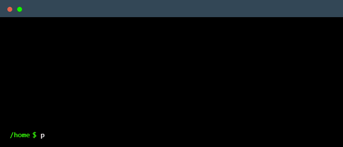

  
 

 
  Visitor count 
  

# Hey there :wave:

Hi, i'm Yair. I am a high school student-athlete in Toronto, Canada.  
I have a passion for computer science and all of its fields. I also have a strong knack for for visual design and hardware engineering.  
During my free time, I love to code, go to the gym, play sports and learn new things!  

## Get in touch :coffee:
- My newly updated [Website](https://yair.ca).
- My [Devpost](https://devpost.com/yair-k) profile.
- My [LinkedIn](https://www.linkedin.com/in/yairkorok/).
- And of course GitHub which you're already on (*Recursion*).
